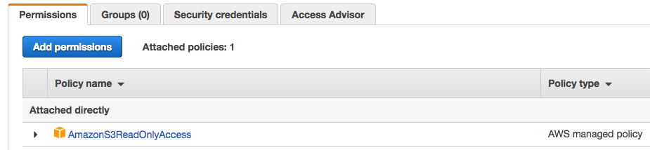
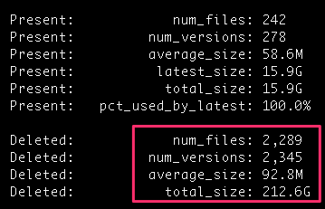

# S3 Disk Usage

Report S3 disk usage stats, including revisions and deleted files.

I wrote this tool in a fit of furstration when I was trying to determine when ~20 GB of 
files in my S3 buckets was being billed as over 200 GB of storage.  You see, I really like having
versioning turned on for safety reasons, but disk space can shoot way up if there are many
versions of a file or if there are many deleted files.

This will report on total use across all versions of a file.

## Prerequisites

You will need to create an account in <a href="https://aws.amazon.com/iam/">AWS IAM</a> that
has read-only access to Amazon S3.  The permissions on that account should look something like this:

Then run `aws configure` from the command line, enter your credentials, and verify
that `aws s3 ls` works.

## Usage 

### Quick and Dirty Version

Run `./go.sh bucketname`.

That will download a listing of all versions and all deleted files in a bucket and print out 
a nice human-readable display that looks something like this:

As you can see, usage the bucket is reasonable, but there were over 200 GB of deleted
files present.  (As it turned out, there was a bucket policy that retained old/deleted versions 
for 365 days--oops!)

#### Report on all buckets

Here's how to get statistics on all of your buckets:

`for BUCKET in $(aws s3 ls |awk '{print $3}' ); do ./go.sh $BUCKET; done |tee output.txt`

This will run statistics for each bucket and write the results to the file `output.txt`.

### More Detailed Usage

There are two core Python scripts: one to download the bucket contents, and one to
go through the resulting JSON and print up stats.  The syntax for each of these is:

`./1-get-bucket-contents.py bucket [file]`

The optional file is the name of the file to write the JSON data to.  The default
location is `output.json`.

The syntax for the second script is:

`./2-process-bucket-contents.py [--humanize] [file]`

If no file is specified, `output.json` will be read from.  Normally, the output
is in JSON format, but if you specify `--humanize` (as the `go.sh` script does), you
will get lovely human-readable output.

## Under The Hood

I originally planned to do this all using <a href="https://boto3.readthedocs.io/en/latest/">Boto 3</a>,
and since I wanted all versions of files, it meant I would have have to use 
<a href="https://boto3.readthedocs.io/en/latest/reference/services/s3.html#S3.Paginator.ListObjectsV2">S3.Paginator.ListObjectsV2</a>
to get that data.  Unfortunately, I found what appears to be a bug: the `NextToken` value was not being 
populated, which means I couldn't fetch more than a single batch of file data.

I did some more research, and discovered that the AWS CLI has a mode called "s3api", which lets you 
use lower-level S3 API functions.  In my case, the command `aws s3api list-object-versions --bucket`
turned out to be useful, as it returns JSON of all versions and all delete markers.  From there,
my script goes through both data structures, determines the current status of a file (deleted or present),
updates a stats data structure on that bucket (including total bytes used across older/deleted versions of a file),
and writes out the bucket stats at the end of the run.

  
## Say Hello!

If you have a bug or a feature request or just wasnt to drop me a line, feel free to add an issue to this project.

I am also <a href="http://twitter.com/dmuth">@dmuth on Twitter</a>
<a href="http://www.facebook.com/dmuth">as well as on Facebook</a>, and can be reached
via email to <b>dmuth AT dmuth DOT org</b>.

